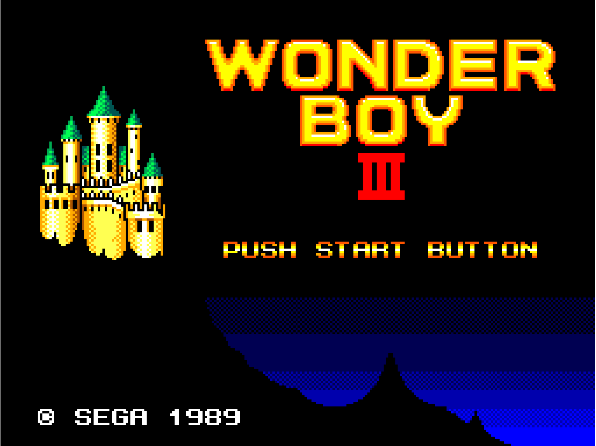

# go-playthemall  

go-playthemall is an attempt to write a libretro frontend written in go.

It is able to launch most non GL libretro cores.

It is tested on OSX, Linux and Windows.

## Dependencies

 * GLFW 3.2
 * OpenGL 4.1
 * OpenAL

On OSX you can execute the following command and follow the instructions about exporting PKG_CONFIG

    brew install glfw openal-soft

On Debian or Ubuntu:

    sudo apt-get install libglfw3-dev libopenal-dev xorg-dev

On Windows, setup openal headers and dll in mingw-w64 `include` and `lib` folders

## Building

    go get github.com/kivutar/go-playthemall
    cd $GOPATH/src/github.com/kivutar/go-playthemall
    go build

## Running

    ./go-playthemall -L nestopia_libretro.so mario3.nes
